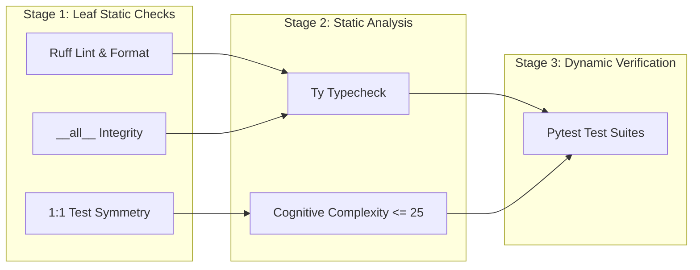

# 🛡️ Hexaqual

[](https://github.com/marketplace/actions/hexaqual-quality-gate)
[](https://codespaces.new/TheTrueSCU/hexaqual)
[](https://github.com/TheTrueSCU/hexaqual/actions/workflows/ci.yml)
[](https://codecov.io/github/TheTrueSCU/hexaqual)
[](https://pypi.org/project/hexaqual/)
[](https://www.python.org/downloads/)
[](LICENSE)

[](https://dopplereffect.us/hexastack/)
[](https://dopplereffect.us/hexaqueue/)
[](https://dopplereffect.us/hexaflow/)
[](https://dopplereffect.us/hexaflow/)
[](https://github.com/astral-sh/ruff)
[](https://github.com/astral-sh/ty)

[](https://securityscorecards.dev/viewer/?uri=github.com/TheTrueSCU/hexaqual)
[](https://www.bestpractices.dev/projects/14749)
[](https://www.bestpractices.dev/projects/14749)

> 🛡️ **Universal quality & governance engine for [Hexastack](https://dopplereffect.us/hexastack/), [Hexaqueue](https://dopplereffect.us/hexaqueue/), and [Hexaflow](https://dopplereffect.us/hexaflow/)** · 🌊 **Execution DAGs powered by [Hexaflow](https://dopplereffect.us/hexaflow/)**


> **Universal Python quality gates, architectural boundary enforcement, and release engineering toolchain.**

Hexaqual provides an opinionated, high-velocity quality harness designed for modular Python architectures, monorepos, and single-package projects. It unifies linting, type-checking, cognitive complexity enforcement, `__all__` integrity, 1:1 test symmetry, and automated PyPI release workflows into a cohesive, workflow-driven developer CLI.

---

## 🚀 Key Features

* **Workflow-Driven Sanity Checks**: Multi-stage DAG pipeline powered by [Hexaflow](https://pypi.org/project/hexaflow/) for parallel linting, typechecking, and testing.
* **Turnkey GitHub Marketplace Action**: Drop-in composite action setting up Python, `uv`, pre-commit caching, and executing quality checks in CI.
* **Architectural Invariants**: First-class support for hexagonal layer enforcement (`domain`, `ports`, `adapters`, `infra`).
* **Test Parity Enforcement**: 1:1 symmetry verification between source modules and unit test suites.
* **Public API Integrity**: Automatic sorting, deduplication, and AST validation of `__all__` exports.
* **Smart PyPI Publishing**: Dependency-ordered, reproducible builds with automatic skip-if-exists checks.

---

## ⚡ GitHub Marketplace Action

Hexaqual is available on the [GitHub Marketplace](https://github.com/marketplace/actions/hexaqual-quality-gate) as a turnkey composite action that automatically sets up `uv`, Python, caches pre-commit environments, and runs your checks:

```yaml
jobs:
  quality-gate:
    runs-on: ubuntu-latest
    steps:
      - uses: actions/checkout@v4
      - uses: TheTrueSCU/hexaqual@v0.4.0
        with:
          mode: "pre-commit" # options: 'pre-commit', 'sanity', 'setup'
          sync-args: "--all-extras --dev"
```

---

## 📦 Installation

```bash
# Add as a development dependency
uv add --dev hexaqual

# Or install globally
uv tool install hexaqual
```

---

## 🛠️ Unified CLI (`hexaqual`)

Hexaqual subsumes all developer quality tools into a single unified entrypoint (`hexaqual`). It dynamically detects workspace layout:
- **Multi-package workspaces** (`packages/` exists): accepts `-p` / `--package` to filter focus across packages, or `-a` / `--all` for the whole workspace.
- **Single-package projects** (no `packages/`): automatically focuses on the root package without requiring `-p`.
- **Examples support**: if an `examples/` directory exists, `-e` / `--example` allows targeted auditing of example projects.

### Command Overview

| Command | Subcommands | Description |
|---|---|---|
| `hexaqual check` (alias: `sanity`) | — | Run the multi-stage quality pipeline (Ruff, Ty, Complexipy, `__all__`, test parity, pytest). |
| `hexaqual statements` | `check`, `fix` | Audit and auto-format `__all__` exports with strict casefold sorting. |
| `hexaqual parity` | `test`, `extras` | Audit 1:1 symmetry between source modules and unit tests, and optional extras forwarding. |
| `hexaqual test` | `run`, `boundary`, `redundancy`, `impact`, `fuzz`, `snapshot`, `archon` | Run pytest suites, boundary assertion audits, redundancy analysis, git impact tests, fuzzing, and inline snapshots. |
| `hexaqual mutate` | `run`, `inspect` | Execute mutation testing via mutmut and inspect critical surviving mutants. |
| `hexaqual release` | `build`, `check`, `publish`, `reproducible` | Build sdist/wheel distributions, verify metadata, and publish to PyPI with smart duplicate skipping. |
| `hexaqual gh` | `pr`, `checks`, `repo`, `security`, `code-scanning`, `codeql` | Inspect PR health dashboards, CI checks, repo governance, Dependabot, and CodeQL alerts. |
| `hexaqual deps` | `audit`, `deptry`, `graph` | Audit dependencies, run deptry checks, and generate dependency graphs via pydeps. |
| `hexaqual imports` | `check`, `generate` | Verify and generate import-linter contracts for hexagonal boundary enforcement. |
| `hexaqual refactor` | `alphabetize`, `rename`, `extract`, `move`, `run` | Automated code refactoring and AST-level symbol alphabetization via Rope. |
| `hexaqual docs` | `usage`, `publish` | Verify/regenerate USAGE.md catalogs and publish Medium articles. |
| `hexaqual agents` | `sync`, `check`, `list` | Synchronize and verify universal `.agents` guardrails (rules, workflows, skills). |
| `hexaqual complexity` | — | Audit cognitive complexity across functions and methods via complexipy. |

```bash
# Run sanity checks on specific packages in a workspace
hexaqual check -p core -p cqrs

# Run sanity check with auto-formatting on a single-package repo
hexaqual check --fix

# Audit __all__ integrity across all packages
hexaqual statements check

# Run pytest on tests impacted by recent git changes
hexaqual test impact

# Examine a GitHub Pull Request dashboard with live polling
hexaqual gh pr 42 --watch

# Verify USAGE.md catalog is up to date
hexaqual docs usage --check
```

For the complete unrolled CLI reference and full option listings for every subcommand, see [USAGE.md](USAGE.md).

---

## 🪝 Pre-Commit Integration

Add Hexaqual to your `.pre-commit-config.yaml` to enforce all static quality gates in under a second:

```yaml
repos:
  - repo: local
    hooks:
      - id: hexaqual-sanity
        name: hexaqual sanity check
        entry: uv run hexaqual sanity --skip-tests
        language: system
        pass_filenames: false
```

---

## 🐕 Dogfooding Hexaflow: Workflows as Architecture

Hexaqual serves as the primary real-world dogfooding ground for [Hexaflow](https://pypi.org/project/hexaflow/), demonstrating how lightweight, in-memory workflow DAGs can orchestrate high-performance developer tooling without complexity or latency.

### The Sanity Workflow DAG
Rather than executing checks in a rigid, monolithic sequence or maintaining ad-hoc shell orchestration, `hexaqual sanity` compiles each target's verification into a declarative `hexaflow.Workflow`:



### Why Dogfooding Hexaflow Matters:
1. **Deterministic Staging & Fail-Fast**: Ultra-fast leaf AST checks (Ruff, `__all__`, test symmetry) execute in Stage 1 (~0.05s), providing immediate feedback before heavier static analysis (Ty, complexipy) or test suites run.
2. **Granular Step Checkpoints**: Each verification step executes within a discrete `StepContext`, recording execution metrics, structured findings, and pass/fail states into an `InMemoryStateStore`.
3. **Zero-Latency Overhead**: Hexaflow's minimal runtime footprint adds virtually zero overhead—the entire 5-stage static check pipeline runs in under **0.6 seconds**.
4. **Resilient Error Isolation**: If a step fails, the workflow gracefully preserves partial reports, enabling the Rich presenter to render complete multi-target dashboards showing exact failure context.

---

## 🤖 Universal AI Guardrails & Agent Management (`.agents/`)

Hexaqual acts as the single source of truth for AI pair programming assistants (Antigravity CLI, Cursor, Claude Code, Windsurf) across the entire `hexa-` family (`hexastack`, `hexaqueue`, `hexaflow`, `hexaqual`).

It implements a **Two-Tier Architecture**:
1. **Universal Guardrails (Managed by `hexaqual`)**: Bundled rules (`hexaqual-*.md`), workflows (`hexaqual-*.md`), and skills (`hexaqual_*.py`) that apply universally across every repository.
2. **Family-Member Guardrails (Local to `X`)**: Repository-specific rules (`hexa<X>-*.md`) that define project-specific invariants (e.g., `hexaqueue-elevation.md`, `hexaflow-dag-invariants.md`). These local assets are preserved untouched during synchronizations.

### Bundled Universal Catalog

| Category | File | Description |
|---|---|---|
| **Rule** | `hexaqual-boundaries.md` | Enforce hexagonal layer isolation (`domain/` -> `ports/` -> `adapters/` -> `infra/`). |
| **Rule** | `hexaqual-test-authoring.md` | 1:1 test parity, `__init__.py` mirroring, pure ABC port mocking, side-effect-free assertions. |
| **Rule** | `hexaqual-hermetic-testing.md` | Hermetically sealed test fixtures, `tmp_path`, zero global state or socket pollution. |
| **Rule** | `hexaqual-docstrings.md` | Mandatory Google docstrings with `Args:`, `Returns:`, `Raises:`, and `Notes/Architectural Intent:`. |
| **Rule** | `hexaqual-workspace.md` | Monorepo hierarchy, subpackage import boundaries, casefold-sorted `__all__` exports. |
| **Rule** | `hexaqual-typing.md` | Python 3.13 generic syntax (`class C[T]:`), zero bare `Any` across domain boundaries. |
| **Rule** | `hexaqual-property-testing.md`| Hypothesis stateful fuzzing (`RuleBasedStateMachine`) for state machines and schedulers. |
| **Rule** | `hexaqual-security.md` | Prohibition of `shell=True`, path traversal guards, secret scanning, least-privilege defaults. |
| **Rule** | `hexaqual-sync.md` | Guardrail invariant to execute `hexaqual agents sync` upon dependency upgrades. |
| **Workflow** | `hexaqual-pre-commit.md` | Fast pre-commit gate (`hexaqual sanity -a --skip-tests`, docs freshness, agent sync). |
| **Workflow** | `hexaqual-pre-push.md` | Full pre-push gate: format drift -> sanity with tests -> graphify -> pre-commit hooks. |
| **Workflow** | `hexaqual-pre-release.md`| Pre-release packaging audit, doc freeze, PyPI availability, reproducible wheel check. |
| **Workflow** | `hexaqual-scaffold-unit.md` | Scaffold domain entity, port, adapter, and mirrored unit test file. |
| **Workflow** | `hexaqual-mutation.md` | Targeted mutation analysis and actionable mutant triage. |
| **Workflow** | `hexaqual-sync.md` | Synchronize shared agent guardrails from installed `hexaqual`. |
| **Skill** | `hexaqual_audit_complexity.py`| Fast function cognitive complexity linter (<= 25 via `complexipy`). |
| **Skill** | `hexaqual_audit_docstrings.py`| AST docstring auditor checking for Google docstrings & Architectural Intent. |
| **Skill** | `hexaqual_scaffold_test_parity.py`| Git-aware test mirror and `__init__.py` scaffolding helper. |

### CLI Synchronization & Drift Verification

```bash
# Synchronize universal guardrails to current repository (preserves local hexaX-* rules)
uv run hexaqual agents sync

# Dry-run simulation of synchronization
uv run hexaqual agents sync --dry-run

# Verify repository guardrails match the installed hexaqual version (pre-commit gate)
uv run hexaqual agents check

# List all universal bundled rules, workflows, and skills
uv run hexaqual agents list
```

### Root Pointer (`AGENTS.md`) & Dynamic Reloading

- **Aggregated Index**: `hexaqual agents sync` creates a root `AGENTS.md` indexing all active rules, workflows, and skills (both universal `hexaqual-*` and project-specific `hexa<X>-*` assets). This ensures single-file agent tools (like GitHub Copilot Workspace) maintain full context.
- **VCS Hygiene**: `hexaqual agents sync` ensures `.gitignore` excludes `.agents/*/hexaqual-*` so upstream assets are never committed to git. Maintainers may commit `AGENTS.md` for GitHub visibility or add it to local `.git/info/exclude` to keep the root directory clean.
- **Per-Turn Dynamic Reloading**: In Antigravity CLI/IDE, rule files under `.agents/rules/` and `AGENTS.md` are dynamically reloaded at the start of each user prompt, so synced guardrails take effect immediately on the next interaction.

---

## 🏛️ Architecture & Documentation

- **[Architecture & Design Guide](docs/architecture.md)**: Hexagonal boundaries, CQRS command bus, and architectural invariants.
- **[AI Agent Governance Guide](docs/agents-guide.md)**: Universal `.agents/` rules, SDLC workflows, colocated skills, and VCS hygiene.
- **[CLI Reference Catalog](USAGE.md)**: Full unrolled command and subcommand trees with exhaustive option listings.

---

## 📄 License

Apache-2.0. See [LICENSE](LICENSE) for details.
