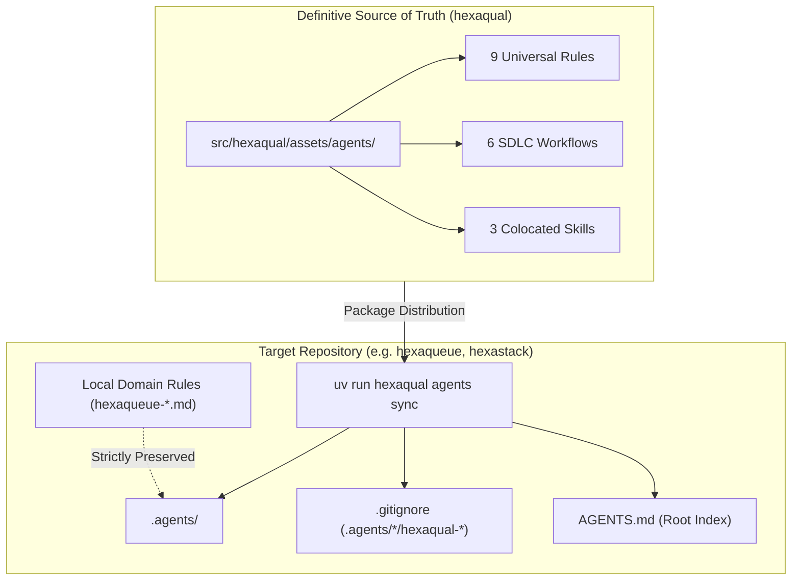

# AI Agent Governance & Guardrails (`.agents/`)

> **Turnkey AI pair-programming guardrails, automated drift synchronization, and hexagonal boundary enforcement across the ecosystem.**

---

## 🌟 The Challenge: AI Coding Drift

Modern AI coding assistants (Google Antigravity, Claude Code, Cursor, Windsurf, GitHub Copilot) excel at generating code rapidly, but they naturally suffer from **architectural drift** over long development trajectories:
- Violating hexagonal layer boundaries by importing outer database adapters or HTTP routers into pure domain cores.
- Breaking strict 1:1 test parity by creating source modules without mirrored unit test suites.
- Forgetting project-specific constraints, such as cognitive complexity ceilings ($\le 25$), docstring formats, or least-privilege CLI flags.
- Leaving duplicate, divergent rule sets scattered across multiple repositories in a project family.

**Hexaqual** solves this by providing a unified **AI Guardrails & Agent Management Subsystem** (`hexaqual agents`). Universal rules, workflows, and skills are packaged directly within `hexaqual`, distributed via PyPI, and synchronized into downstream repositories with zero manual copy-pasting.



---

## 🏛️ Architecture: Upstream Source vs. Local Materialization

### 1. Single Definitive Source of Truth
All universal guardrails are authored, tested, and maintained exclusively inside `src/hexaqual/assets/agents/` in the `hexaqual` repository:
- **`rules/`**: Architectural constraints, coding invariants, and security guidelines.
- **`workflows/`**: Step-by-step procedural runbooks aligned with SDLC phases.
- **`skills/`**: Standalone Python scripts callable by agents for AST analysis, complexity auditing, and scaffolding.

### 2. Local Materialization & Non-Destructive Merging
When `uv run hexaqual agents sync` executes in a downstream repository:
1. Universal assets are materialized into `.agents/rules/`, `.agents/workflows/`, and `.agents/skills/`.
2. Existing managed files are updated to match the installed package version.
3. **Local Domain Rules Are Strictly Preserved**: Any rule or workflow that does not match the `hexaqual-*` or `hexaqual_*` naming prefix (such as `hexaqueue-elevation.md`, `hexaflow-dag-invariants.md`, or `graphify.md`) is untouched.

---

## 🛡️ The Universal Guardrail Suite

### 1. The 9 Universal Rules (`.agents/rules/`)

| Rule | File | Purpose & Architectural Intent |
|---|---|---|
| **Hexagonal Isolation** | `hexaqual-boundaries.md` | Strict hexagonal layer separation (`domain/`, `ports/`, `adapters/`, `infra/`) and unidirectional import hierarchy. |
| **Docstrings & Intent** | `hexaqual-docstrings.md` | Mandatory Google docstrings with `Args:`, `Returns:`, `Raises:`, and `Notes/Architectural Intent:` design rationale. |
| **Hermetic Testing** | `hexaqual-hermetic-testing.md` | Total test isolation, `tmp_path` fixtures, zero persistent filesystem or network pollution. |
| **Test Symmetry** | `hexaqual-test-authoring.md` | Strict 1:1 structural symmetry between `src/` and `tests/unit/`, side-effect free assertions. |
| **Modern Typing** | `hexaqual-typing.md` | Python 3.13 generic parameter syntax (`class C[T]:`), zero bare `Any` across domain boundaries. |
| **Workspace Structure** | `hexaqual-workspace.md` | Monorepo and single-package layout conventions, casefold-sorted `__all__` export integrity. |
| **Property Testing** | `hexaqual-property-testing.md` | Hypothesis stateful fuzzing (`RuleBasedStateMachine`) for schedulers, state engines, and queues. |
| **Defensive Security** | `hexaqual-security.md` | Prohibition of `shell=True`, path traversal validation, secret scanning, and least-privilege defaults. |
| **Synchronization** | `hexaqual-sync.md` | Mandate to verify and synchronize guardrails whenever dependencies are upgraded. |

### 2. The 6 SDLC-Aligned Workflows (`.agents/workflows/`)

| Workflow | File | SDLC Phase & Purpose |
|---|---|---|
| **Pre-Commit Gate** | `hexaqual-pre-commit.md` | Fast inner-loop static sanity (<1s), format auto-fixes, doc freshness, link validation, and agent sync. |
| **Pre-Push Gate** | `hexaqual-pre-push.md` | Full pre-flight verification: sanity with tests, architecture boundary parity, AST graph sync, and pre-commit checks. |
| **Pre-Release Gate** | `hexaqual-pre-release.md` | Documentation freeze, diagram refresh, reproducible wheel build verification, and PyPI status check. |
| **Scaffold Unit Test** | `hexaqual-scaffold-unit.md` | Scaffolding 1:1 test mirror and `__init__.py` hierarchy prior to implementing source code. |
| **Mutation Testing** | `hexaqual-mutation.md` | Scoped mutation testing via `mutmut` and triage of surviving mutants. |
| **Guardrails Sync** | `hexaqual-sync.md` | Synchronize shared agent rules, workflows, and skills from the installed `hexaqual` distribution. |

### 3. The 3 Colocated Agent Skills (`.agents/skills/`)

| Skill | Executable Script | Capability |
|---|---|---|
| **Complexity Auditor** | `hexaqual_audit_complexity.py` | Fast function cognitive complexity auditor enforcing $\le 25$ via `complexipy`. |
| **Docstrings Auditor** | `hexaqual_audit_docstrings.py` | AST docstring auditor validating Google docstrings and Architectural Intent sections. |
| **Test Parity Scaffolder** | `hexaqual_scaffold_test_parity.py` | Git-aware test mirror and missing `__init__.py` generator. |

---

## 🔒 VCS Hygiene & Tracking Strategy

To prevent repository clutter and conflicting sources of truth, Hexaqual enforces a strict division between what is tracked in version control and what remains local:

```
┌────────────────────────────────────────────────────────────────────────┐
│                        Version Control Strategy                        │
├────────────────────────────────┬───────────────────┬───────────────────┤
│ Asset Category                 │ Example           │ Git Destination   │
├────────────────────────────────┼───────────────────┼───────────────────┤
│ Universal Upstream Assets      │ hexaqual-*.md     │ .gitignore        │
│                                │ hexaqual_*.py     │ (Ignored)         │
├────────────────────────────────┼───────────────────┼───────────────────┤
│ Project-Specific Domain Rules  │ hexaqueue-*.md    │ Git Tracked       │
│ & Local Tools                  │ graphify.md       │ (Committed)       │
├────────────────────────────────┼───────────────────┼───────────────────┤
│ Machine/Local Root Pointers    │ AGENTS.md         │ Maintainer Choice │
│                                │ GEMINI.md         │ (.git/info/exclude│
│                                │                   │  or committed)    │
└────────────────────────────────┴───────────────────┴───────────────────┘
```

1. **Why `hexaqual-*` Assets are in `.gitignore`**:
   The authoritative source of truth is packaged inside `hexaqual`. Downstream repositories materialize them locally on demand. Ignoring them in `.gitignore` avoids phantom git diffs whenever `hexaqual` is updated.
   `hexaqual agents sync` automatically appends these patterns to `.gitignore` if they are missing:
   ```gitignore
   # Hexaqual managed agent assets (materialized via hexaqual agents sync)
   .agents/rules/hexaqual-*
   .agents/workflows/hexaqual-*
   .agents/skills/hexaqual_*
   ```
2. **Why Repository-Specific Rules are Tracked**:
   Rules such as `hexaqueue-elevation.md` or `hexaflow-dag-invariants.md` represent domain constraints specific to project `X`. They are committed directly to `project-X`'s git repository.
3. **Maintainer Preference on `AGENTS.md` & `GEMINI.md`**:
   `hexaqual agents sync` generates an aggregated root `AGENTS.md` indexing all active rules and workflows. Whether a project commits `AGENTS.md` to git (for visibility on GitHub) or keeps it local via `.git/info/exclude` (to prevent root directory clutter) is left entirely to maintainer preference.

---

## 🔄 Dynamic Discovery & Agent Reloading

How do AI coding assistants consume and reload updated guardrails?

1. **Antigravity CLI / IDE**:
   - Dynamic per-turn scanning: Antigravity traverses `.agents/rules/*.md` and `AGENTS.md` at the start of each conversation turn.
   - Any updates written to disk by `hexaqual agents sync` take effect on the **very next prompt** without restarting the CLI session or daemon.
2. **Single-File Agent Tools (Claude Code, Cursor, GitHub Copilot)**:
   - For tools that only inspect a single root configuration file, the generated `AGENTS.md` links all modular rules, workflows, and active skills into a single indexed dashboard.

---

## 💻 CLI Command Reference

### Synchronize Guardrails (`sync`)
Synchronizes bundled rules, workflows, and skills into `.agents/` and updates the root `AGENTS.md`:

```bash
# Synchronize to current repository (auto-updates .gitignore and AGENTS.md)
hexaqual agents sync

# Target an explicit repository path
hexaqual agents sync --target /path/to/project

# Simulate synchronization without writing to disk
hexaqual agents sync --dry-run
```

### Audit Drift (`check`)
Audits whether local `.agents/` assets and `.gitignore` patterns match the installed package:

```bash
# Returns 0 if clean, 1 if drifted
hexaqual agents check

# Machine-readable output for CI pipelines
hexaqual agents check -f json
```

### List Bundled Assets (`list`)
Displays an interactive catalog of all bundled rules, workflows, and skills:

```bash
hexaqual agents list
```

---

## 🪝 Pre-Commit Hook Integration

Add the `hexaqual-agents` hook to your repository's `.pre-commit-config.yaml` to guarantee that code cannot be committed with stale or drifted guardrails:

```yaml
repos:
  - repo: https://github.com/TheTrueSCU/hexaqual
    rev: v0.5.0
    hooks:
      - id: hexaqual-agents
      - id: hexaqual-sanity
```

If drift is detected, the hook fails with actionable instructions:
```
❌ Agent Guardrails Drift Detected!
Missing managed asset: rules/hexaqual-boundaries.md
Missing .gitignore exclusion: .agents/rules/hexaqual-*

Run `uv run hexaqual agents sync` to synchronize guardrails.
```
