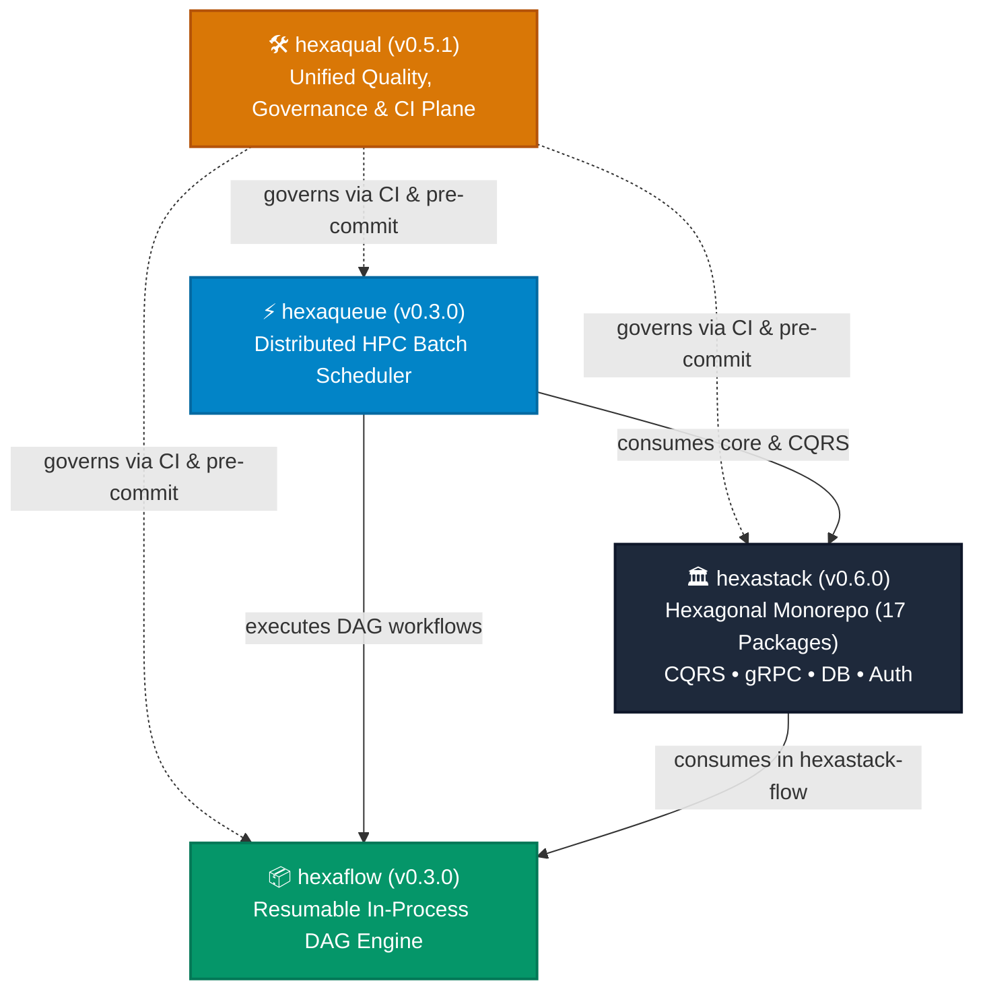

# Hexa Ecosystem Architecture

> **The Four Pillars of the Hexa Family**: A unified suite of specialized, highly-cohesive Python projects enforcing hexagonal boundaries, predictable state, and zero-compromise engineering discipline from localhost development to distributed cluster orchestration.

---

## 🏛️ The Four Pillars

| Pillar | Focus & Invariants | Key Capabilities |
|---|---|---|
| [**`hexaqual`**](https://dopplereffect.us/hexaqual/) | Unified Quality & Governance Plane | Standalone developer toolsuite providing turnkey pre-commit hooks, CI composite actions, cognitive complexity enforcement, test parity checks, mutation testing triage, and architectural boundary verification. |
| [**`hexastack`**](https://dopplereffect.us/hexastack/) | Enterprise Application Framework | 17 subpackages implementing pure Hexagonal Architecture (Ports & Adapters), CQRS dispatching, database repositories, transactional outbox with NATS JetStream, multi-protocol transports (FastAPI, gRPC, GraphQL, CLI), and NiceGUI/Textual DevTools. |
| [**`hexaqueue`**](https://dopplereffect.us/hexaqueue/) | Distributed Batch Scheduler | High-throughput, distributed execution and scheduling plane for HPC batch workloads, runners (GitHub, GitLab, Kueue), and multi-step workflows with split/join barrier resolution. |
| [**`hexaflow`**](https://dopplereffect.us/hexaflow/) | In-Process Workflow DAG Engine | Zero-external-dependency (stdlib + Pydantic) DAG executor with dynamic collection fan-out (`@wf.map_step`), automatic dependency inference, cycle detection, and SQLite state checkpointing. |

---

## 🗺️ Unified Ecosystem Architecture Map

The following interactive diagram illustrates package-level dependency relationships across the Hexa ecosystem, distinguishing between foundation layers, APIs, infrastructure adapters, execution runners, and tooling governance:

```mermaid
%%{init: {
  'theme': 'base',
  'flowchart': {
    'subGraphTitleMargin': { 'top': 25, 'bottom': 25 },
    'nodeSpacing': 45,
    'rankSpacing': 120,
    'curve': 'basis'
  }
}}%%
flowchart TB

    %% ==========================================
    %% CLASS DEFINITIONS & PALETTE
    %% ==========================================
    classDef foundation fill:#1e293b,stroke:#0f172a,stroke-width:2px,color:#f8fafc;
    classDef transport  fill:#0284c7,stroke:#0369a1,stroke-width:1.5px,color:#ffffff;
    classDef infra      fill:#d97706,stroke:#b45309,stroke-width:1.5px,color:#ffffff;
    classDef feature    fill:#059669,stroke:#047857,stroke-width:1.5px,color:#ffffff;
    classDef runner     fill:#10b981,stroke:#059669,stroke-width:1.5px,color:#ffffff;
    classDef external   fill:#6366f1,stroke:#4f46e5,stroke-width:1.5px,color:#ffffff;

    %% Container Styles
    style hexaqueue fill:#f8fafc,stroke:#94a3b8,stroke-width:2px,stroke-dasharray: 4 4;
    style hexastack fill:#f8fafc,stroke:#94a3b8,stroke-width:2px,stroke-dasharray: 4 4;
    style hq_services fill:#f1f5f9,stroke:#cbd5e1;
    style hq_runners fill:#f1f5f9,stroke:#cbd5e1;
    style hs_extensions fill:#f1f5f9,stroke:#cbd5e1;
    style hs_transports fill:#f1f5f9,stroke:#cbd5e1;
    style hs_infra fill:#f1f5f9,stroke:#cbd5e1;
    style hs_base fill:#e2e8f0,stroke:#94a3b8;

    %% ==========================================
    %% NODES & SUBGRAPHS
    %% ==========================================
    subgraph hexaqueue["hexaqueue"]
        direction TB
        subgraph hq_services["Services & Entrypoints"]
            hexaqueue_cli["-cli"]:::feature
            hexaqueue_dashboard["-dashboard"]:::feature
            hexaqueue_server["-server"]:::feature
            hexaqueue_worker["-worker"]:::feature
            hexaqueue_collateral["-collateral"]:::feature
            hexaqueue_monitor["-monitor"]:::feature
            hexaqueue_scanner["-scanner"]:::feature
        end

        subgraph hq_runners["Runners & Pipelines"]
            hexaqueue_github_runner["-github-runner"]:::runner
            hexaqueue_gitlab_runner["-gitlab-runner"]:::runner
            hexaqueue_kueue["-kueue"]:::runner
            hexaqueue_workflow["-workflow"]:::runner
        end

        hexaqueue_core["-core"]:::foundation
    end

    subgraph hexastack["hexastack"]
        direction TB

        subgraph hs_extensions["Engines & Capabilities"]
            hexastack_ai["-ai"]:::feature
            hexastack_flow["-flow"]:::feature
            hexastack_mcp["-mcp"]:::feature
            hexastack_ui["-ui"]:::feature
            hexastack_flags["-flags"]:::feature
        end

        subgraph hs_transports["APIs & Transports"]
            hexastack_cli["-cli"]:::transport
            hexastack_fastapi["-fastapi"]:::transport
            hexastack_graphql["-graphql"]:::transport
            hexastack_grpc["-grpc"]:::transport
        end

        subgraph hs_infra["Infra & Observability"]
            hexastack_auth["-auth"]:::infra
            hexastack_db["-db"]:::infra
            hexastack_events["-events"]:::infra
            hexastack_logging["-logging"]:::infra
            hexastack_otel["-otel"]:::infra
        end

        subgraph hs_base["Foundation"]
            hexastack_cqrs["-cqrs"]:::foundation
            hexastack_core["-core"]:::foundation
        end
    end

    hexaflow["hexaflow"]:::external
    hexaqual["hexaqual"]:::external

    %% ==========================================
    %% INVISIBLE SPACING CONSTRAINTS
    %% ==========================================
    hexaqueue_core ~~~ hexastack_cli
    hexaqueue_core ~~~ hexastack_fastapi

    %% ==========================================
    %% EDGES
    %% ==========================================

    %% 1. Hexaqueue Internal Wiring
    hq_services --> hexaqueue_core
    hq_runners --> hexaqueue_core
    hexaqueue_cli --> hexaqueue_server
    hexaqueue_cli --> hexaqueue_worker
    hexaqueue_cli --> hexaqueue_workflow
    hexaqueue_workflow --> hexaqueue_server
    hexaqueue_workflow --> hexaqueue_worker

    %% 2. Hexastack Internal Wiring
    hs_extensions & hs_transports & hs_infra --> hexastack_cqrs
    hs_extensions & hs_transports & hs_infra --> hexastack_core
    hexastack_cqrs --> hexastack_core

    %% 3. Cross-Repo Links: Hexaqueue -> Hexastack
    hexaqueue_core --> hexastack_core & hexastack_cqrs
    hexaqueue_cli --> hexastack_cli & hexastack_grpc & hexastack_cqrs & hexastack_core
    hexaqueue_collateral --> hexastack_auth & hexastack_core & hexastack_events & hexastack_fastapi
    hexaqueue_dashboard --> hexastack_auth & hexastack_fastapi & hexastack_grpc
    hexaqueue_monitor --> hexastack_core & hexastack_events & hexastack_otel
    hexaqueue_scanner --> hexastack_auth & hexastack_core & hexastack_events & hexastack_logging
    hexaqueue_worker --> hexastack_auth & hexastack_core & hexastack_grpc & hexastack_logging
    hexaqueue_server --> hexastack_auth & hexastack_core & hexastack_cqrs & hexastack_db & hexastack_events & hexastack_fastapi & hexastack_grpc & hexastack_otel
    hexaqueue_workflow --> hexastack_core & hexastack_grpc

    %% 4. Hexaflow Engine Integrations
    hexastack_flow --> hexaflow
    hexaqueue_workflow --> hexaflow

    %% 5. Optional Extras
    hexastack_fastapi -. "[auth]" .-> hexastack_auth
    hexastack_graphql -. "[fastapi]" .-> hexastack_fastapi
    hexastack_mcp -. "[fastapi]" .-> hexastack_fastapi
    hexastack_ui -. "[fastapi]" .-> hexastack_fastapi
    hexastack_flow -. "[db]" .-> hexastack_db
    hexastack_flow -. "[events]" .-> hexastack_events

    %% 6. Tooling & Governance (Hexaqual Plane)
    hexaqual --> hexaflow
    hexaflow -. "dev" .-> hexaqual
    hexastack -. "dev" .-> hexaqual
    hexaqueue -. "dev" .-> hexaqual
```

---

## 🔗 Cross-Repository Architectural Contracts

1. **`hexaqual` Governance Plane**:
   - `hexaqual` acts as the universal quality and architectural enforcement engine for `hexastack`, `hexaqueue`, and `hexaflow`.
   - Turnkey pre-commit hooks and GitHub Actions composite workflows (`TheTrueSCU/hexaqual@v0.5.1`) verify 1:1 test parity, cognitive complexity $\le 25$, casefolded `__all__` sorting, and import-linter hexagonal boundary enforcement.
   - Synchronizes universal agent guardrails across all repositories (`.agents/rules/`, `.agents/workflows/`, `.agents/skills/`) to anchor AI coding assistants without drift.

2. **`hexaqueue` $\to$ `hexastack` Contract**:
   - `hexaqueue-core` and `hexaqueue-server` leverage `hexastack-core` for base domain primitives, event envelope serialization, and `hexastack-cqrs` for pipeline execution.
   - Remote communication between `hexaqueue-cli`, `hexaqueue-server`, and `hexaqueue-worker` is powered by `hexastack-grpc` transport adapters.
   - Long-lived persistence and transaction outbox events are dispatched through `hexastack-db` and `hexastack-events`.

3. **`hexastack-flow` $\to$ `hexaflow` Contract**:
   - `hexaflow` provides the lightweight, zero-dependency DAG execution engine.
   - `hexastack-flow` wraps `hexaflow` to provide enterprise-grade persistence adapters (`SqlAlchemyWorkflowStore`, `RedisWorkflowStore`) backed by `hexastack-db` without polluting `hexaflow`'s zero-dependency footprint.

4. **`hexaqueue-workflow` $\to$ `hexaflow` Contract**:
   - `hexaqueue-workflow` orchestrates distributed batch pipelines by compiling workflow definitions into `hexaflow` execution DAGs, resolving distributed split/join barriers over `hexastack-grpc`.
