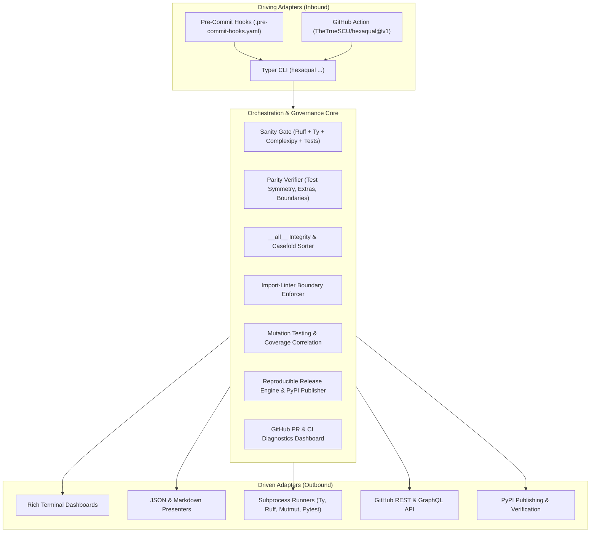

# Hexaqual

> **Universal Python quality gates, architectural boundary enforcement, and release engineering toolchain.**

[](https://www.python.org/downloads/)
[](https://github.com/TheTrueSCU/hexaqual/blob/main/LICENSE)
[](architecture.md)
[](cli-reference.md)

---

## 🌟 Why Hexaqual?

Standard formatters and linters (Ruff, Flake8, Black) ensure syntactic style, but they cannot detect **architectural erosion**:
- Did a core domain model accidentally import a database adapter?
- Did a developer add a 500-line service module without a matching unit test suite?
- Are optional extras declared in subpackages failing to forward into the umbrella package?
- Is `__all__` unsorted or leaking private symbols?
- Can your wheel distribution packages build byte-for-byte reproducibly?

**Hexaqual** provides unified governance and automated architectural assertions across monorepos and standalone Python packages in a fast, turnkey CLI and pre-commit toolsuite:



---

## ⚡ Core Capabilities

- **🚀 Sub-11s Monorepo Sanity**: Validates code style, static types (`ty`), cognitive complexity (`complexipy`), `__all__` sorting, test parity, and unit test suites across 17 packages in seconds.
- **📐 Architectural Boundary Enforcement**: Verifies strict hexagonal layers (`domain` never imports `adapters`; `adapters` never import `infra`) via `import-linter`.
- **🧪 1:1 Test Parity**: Guarantees that every `src/<pkg>/<path>.py` file has a matching `tests/unit/<path>/test_<name>.py` and dedicated `test_hexagonal_boundaries.py` architectural suites.
- **🧬 Mutation Testing & Coverage Correlation**: Drives `mutmut` mutation testing and correlates surviving mutants directly with line coverage data.
- **📦 Reproducible Packaging**: Builds sdist/wheels, audits metadata integrity, verifies byte-for-byte reproducibility, and publishes to PyPI skipping existing releases.
- **🔍 GitHub & PR Intelligence**: Live PR inspection dashboards, check-run summaries, CodeQL scanning alert triage, and Dependabot security audits.

---

## 🚀 Quickstart

Install Hexaqual with `uv`:

```bash
# Add as dev dependency
uv add --dev hexaqual[all]

# Or run instantly with uvx
uvx hexaqual sanity
```

Run a fast scoped sanity check on a specific package:

```bash
uv run hexaqual sanity -p my_package
```

Or run the full workspace quality gate:

```bash
uv run hexaqual sanity -a --skip-tests
```

---

## 📖 Explore the Documentation

- [Architecture & Design](architecture.md) — Hexagonal layers, CQRS dispatching, and design invariants.
- [CLI Command Catalog](cli-reference.md) — Comprehensive command and flag documentation.
- [AI Agent Governance](agents-guide.md) — Universal `.agents/` rules, workflows, skills, and VCS hygiene.
- [Pre-Commit Integration](pre-commit-guide.md) — Setting up fast pre-commit hooks.
- [CI/CD & GitHub Actions](ci-cd-integration.md) — Automated PR quality gates, reproducible builds, and OpenSSF Gold workflows.
